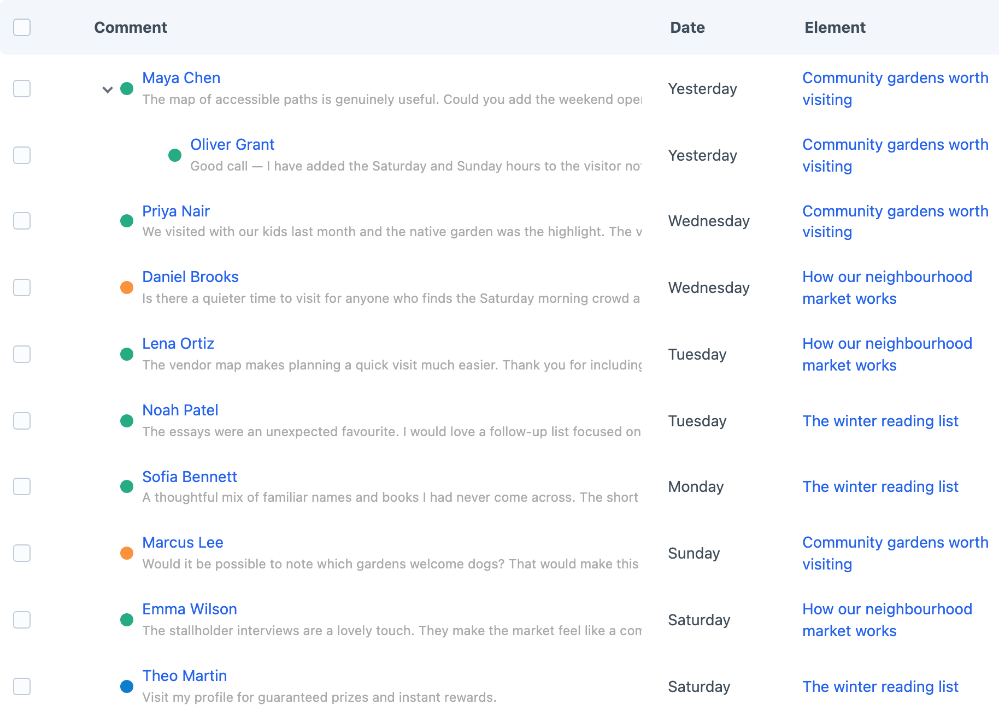
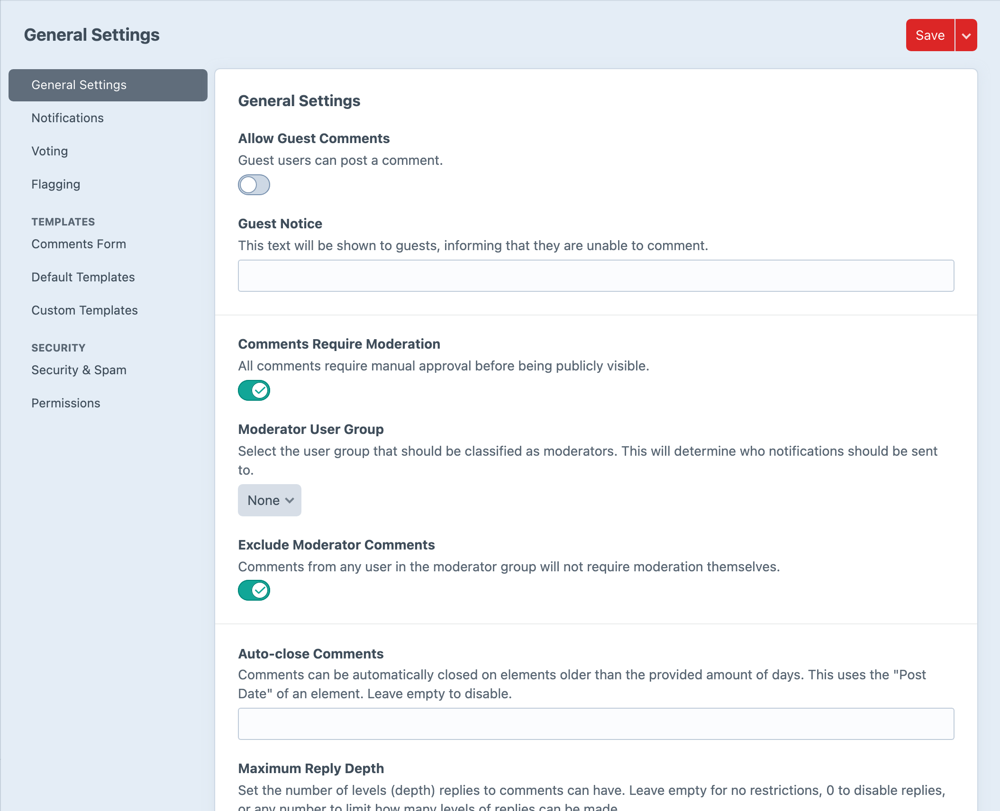
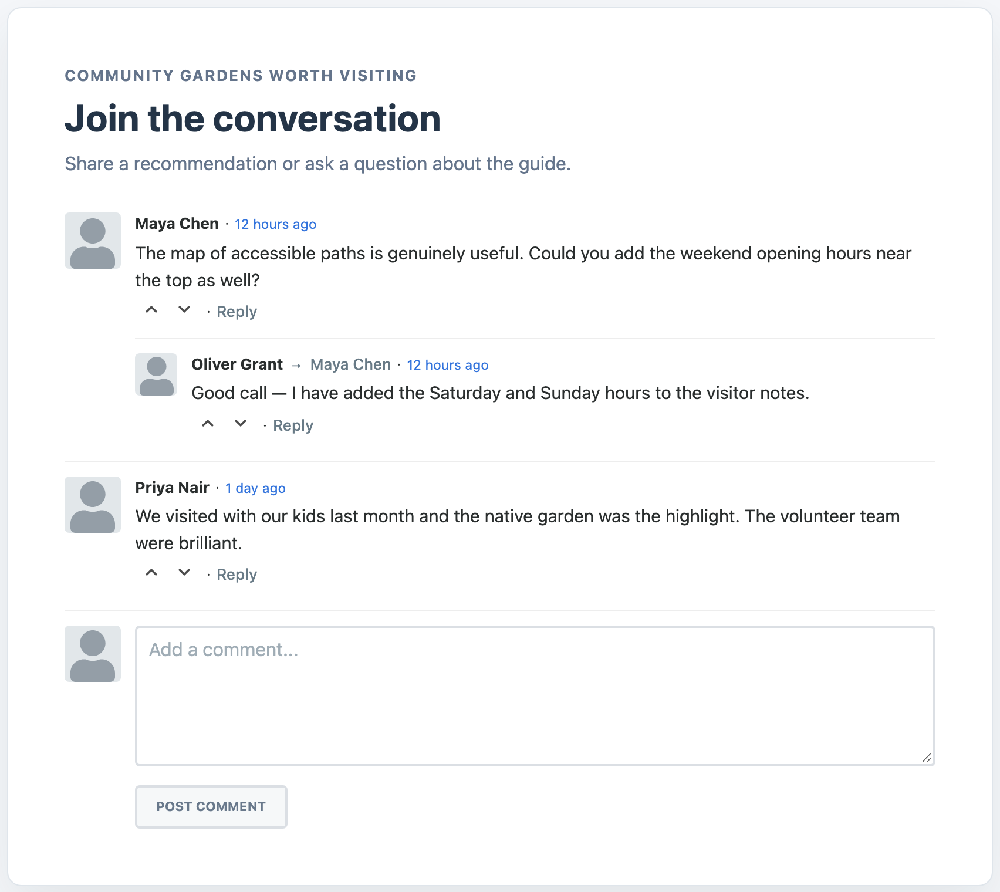

<!-- feature-intro -->
Take control of comments by keeping them alongside your Craft content. The whole experience is self-hosted, ad-free and flexible enough to shape around your site.
<!-- feature-intro-end -->

<!-- feature-section media-size="large" -->
## Comment on anything

Attach comments to any supported Craft element — whether it is an entry, product, event or something project-specific. Threaded replies keep conversations readable while votes and flags give the community useful ways to respond.

<!-- feature-section-end -->

<!-- feature-media media-size="large" media-shadow="false" -->
## Settings for everything

Control moderation, guest participation, notifications and captcha protection. Hold new comments for approval and automatically hide content after enough flags when that suits the community. Optional GIPHY replies and member reputation add more personality when the site calls for them.

<!-- feature-media-end -->

<!-- feature-section -->
## Choose where comments belong

Enable comments for the element groups that should host a conversation, from entry sections and category groups to asset sources, users and supported custom elements. Add the Comment Options field when an author needs to switch commenting on or off for one particular element.

Security rules can inspect the submitted comment, email address, URL, user agent and IP address, then hold a match for moderation, mark it as spam or block it completely.
<!-- feature-section-end -->

<!-- feature-section media-size="medium" -->
## Ready-made or custom

Render a ready-to-go comment list and form with the included Twig, CSS, and JavaScript, or override the templates and resources for a bespoke experience. The underlying comment elements remain available for custom querying and integration.

<!-- feature-section-end -->
